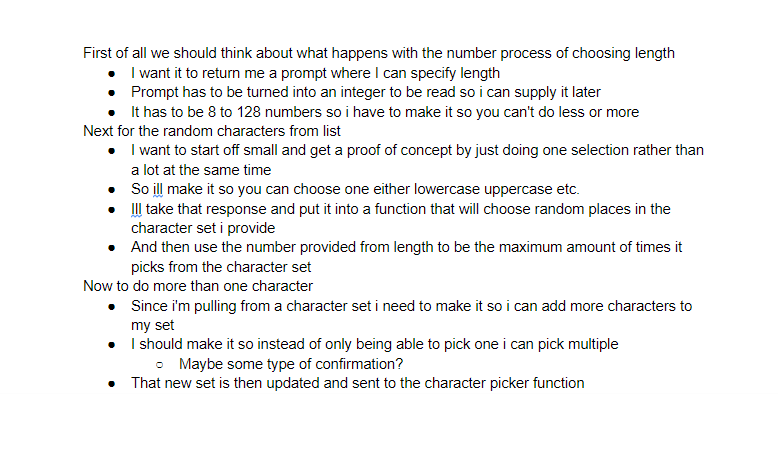
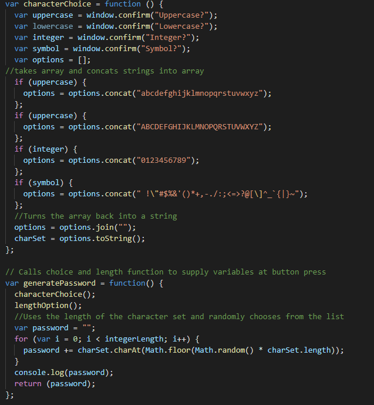
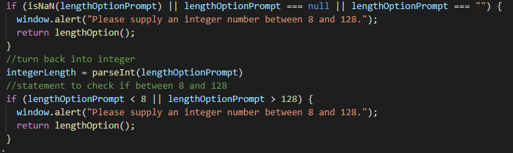

# JS Password Generation

## Description
  Hi this is my attempt at creating javascript that takes your inputs and turns them into a random password at the press of a button on a website. My thinking process for this assignment was to first map out what I wanted to the javascript to do first by pseduocoding everything. I will attach a relevant screenshot of my pseudocode process in the screenshots section. First of all I wanted to do the length function. I solved this by having a window.prompt ask for the length the user would like for the password to be. I also made sure to convert the prompt answer to an integer so it can be read correctly by my password generating function. From testing of this function I realized that if string as my awnser or didnt put any at all I would run into an error in which i would log NaN/null. I solved this by writing an if statement to check the response and return the prior prompt if a answer was not correctly stated by the user. Screenshots of that function will be shown also. Next I wanted to get a proof of concept going for my character set chooser and the actual generator for the password. I decided to just do it so you could select one option for now as I worked out how to get the character picker function to work. for the character picker function I took the length of the string and multiplied it by the floor of the math random to get different characters. It basically looks into the string and takes a random position number and uses that as the character. For example if I have a string like "Food" if i get .charAt for 2 it will choose "o" from the string. A screenshot of that will be provided also. After that I ran into my biggest roadblock. Getting multiple options to work for my character set. I learned from a helpful TA that i can use the concat function to add into an array without erasing previous items in the array. So with this knowledge I created a new window.confirm to house all my questions for the charset. I took those and if they were true or false added or didnt add the character set to the array. Now that that was out of the way I ran into the problem of turning my array back into a string without having it be seperated by commas. I solved this by adding a .join function to join the whole array together into one. A screenshot will also be provided of that!
## Installation
  Deployment url below! or if you would like to pull the code and see for yourself,
  git clone "https://github.com/aaronquach123/javascriptpasswordgen.git"
## Usage
 1. Click deployment url
 2. Click on generate password
 3. Supply integer between 8 and 128
 4. Confirm or decline questions with character sets
 5. The javascript will then create your new random password
## Deployment
https://aaronquach123.github.io/javascriptpasswordgen/

## Screenshots

## Credits
Credits for helping me through my javascript problems to the TAS!
